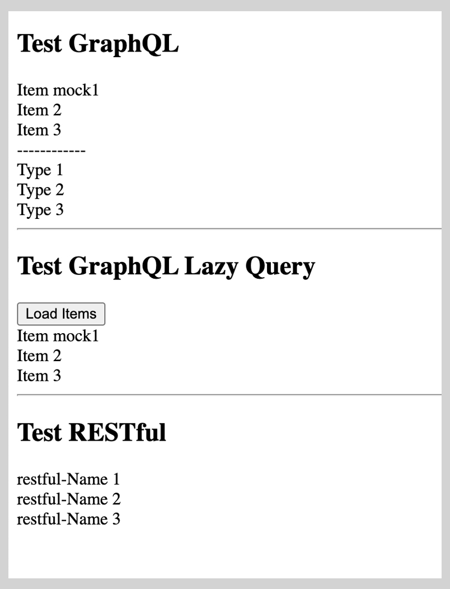

# GraphQL Easy Mock


**GraphQL Easy Mock** is an API mock development tool that supports both GraphQL and traditional RESTful APIs.

## Installation

The plugin has not been published to the application market yet. You can import the `dist` package from the root directory of this repository into your Chrome extension. Follow these steps:

1. Click on the Chrome plugin button and then click on "Manage extensions".
   
2. Click "Enable developer mode" in the top right corner.
   
3. Click "Load unpacked".
   
4. Import the `dist` package from the root directory of this repository.
   
5. The plugin has been successfully installed in your Chrome browser.
   

## Usage

Using GraphQL Easy Mock is very simple:
1. Select your mock type, GraphQL or RESTful. Here, we use GraphQL as an example.
2. Enter the path, operation name, and HTTP status code (default is 200).
   
3. Use any GraphQL dev tool to view the response of the request you want to mock, and copy it.
   
4. Paste it into the response JSON field of the plugin and adjust the mock content as needed.
   
5. You can see the mock has been successfully applied.
   
   

## Exploring More Features

I have written an example for you, which includes a Node server and a React page. You can also experience RESTful mock, HTTP codes, and simultaneously generate multiple mock rules.



### How to Use the Example:
1. Navigate to the server directory:
    ```sh
    cd example/server
    pnpm install
    pnpm start
    ```
2. Navigate to the client directory:
    ```sh
    cd example/client
    pnpm install
    pnpm start
    ```

## Design Philosophy

1. **Selective Mocking for Realistic Development:**
    - Unlike most mock platforms that return complete mock data for all configured API rules, GraphQL Easy Mock allows for more nuanced control. It enables maintaining realistic logic for major interfaces while returning mock data for new interfaces based on specific rules. This ensures that frontend developers can experience the full business logic even in the development environment, focusing mock responses only where needed.

2. **No Local Server Requirement:**
    - Many mock platforms require a local Node server to be started. GraphQL Easy Mock, however, is a plugin that works out of the box. There is no need to manually change request addresses or use local server reverse proxies (like Charles to forward requests to the test server). You only need to enable it in the browser to intercept requests and inject mock data.

3. **Exception Simulation:**
    - It supports the simulation of various HTTP codes, making it easy to directly simulate scenarios like 404 and 500 errors. This is useful for testing error handling in the frontend.

## Planned Features

1. **Enhanced Mock Data with mock.js:**
    - Currently, the mock JSON data must be manually entered. In future versions, integration with `mock.js` is planned to enrich the types of mock data available, making the mock data generation process more versatile and automated.

2. **Test ID Storage and Fetching for Efficient Bug Reproduction:**
    - Sometimes, frontend bugs (which are not of interest to backend testing but are crucial for frontend display) can be time-consuming to reproduce and debug through communication between testers and frontend developers. We are considering storing and fetching test cases through test IDs, enabling one-click sharing of test cases via a functional plugin. This will streamline the process and save valuable time.

3. **Request Timeout Simulation:**
    - Future updates will support the simulation of request timeouts, allowing developers to test and handle such scenarios efficiently within the development environment.

